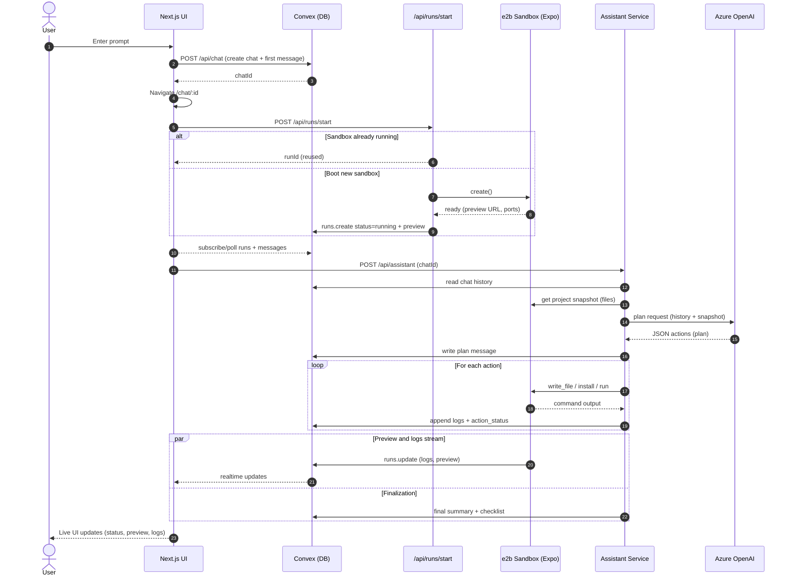

# Bloom Home-Task

Turn prompt into working Expo previews. 

This app combines Next.js, Convex,
Azure OpenAI, and the e2b sandbox to plan code, execute it remotely, and stream the result.

## Summary
- [What You Can Do](#what-you-can-do)
- [Assistant Toolbelt](#assistant-toolbelt)
- [Features](#features)
- [Tech Stack](#tech-stack)
- [Project Structure](#project-structure)
- [How It Works](#how-it-works)
- [API Endpoints](#api-endpoints)
- [Environment Variables](#environment-variables)
- [Getting Started](#getting-started)
- [Assistant Workflow](#assistant-workflow-detailed)
- [Prompts & AI Strategy](#prompts--ai-strategy)
- [Crucial Concepts to Understand](#crucial-concepts-to-understand)
- [Sandbox Behavior](#sandbox-behavior)
- [Expo Sandbox Limitations](#expo-sandbox-limitations)
- [UI Notes](#ui-notes)
- [Development Tips](#development-tips)
- [Deployment](#deployment)
- [Troubleshooting](#troubleshooting)

## What You Can Do
- Ship new Expo screens or flows from plain-language prompts—the assistant plans the work, writes files, and triggers HMR so you see the changes instantly.
- Reuse or reboot a remote e2b sandbox that streams both the Expo web preview and raw logs into the chat UI.
- Iterate safely: review the proposed plan, inspect intermediate action logs, and download the run transcript before committing changes.


## Assistant Toolbelt
The Azure-hosted assistant executes structured actions defined in `lib/ai/tools`. Each action hits the e2b sandbox rooted at `/home/user/app`.

| Action | Description |
| --- | --- |
| `write_file` | Create or overwrite files, ensure parent directories exist, and `touch` the file to trigger Expo's HMR. Honors `SANDBOX_MIRROR_LOCAL=1` to mirror writes back to your repo. |
| `read_file` | Read file contents, cache them for follow-up generations, and surface helpful directory listings when a file is missing. |
| `list_dir` | List folders or files (optionally recursive with a custom `depth`) to understand the current project layout. |
| `run` | Run shell commands inside the project (guardrails block scaffolding/clone commands) with support for background tasks and streamed stdout. |
| `install_package` | Run `npm install` (or `npm install --save-dev`) in the project root or a specified path with sanitised package names. |
| `remove_file` | Delete files from the sandbox when cleanup is required. |

The planning prompt in `lib/ai/tools/planning/index.ts` drives the Observer → Reflect → Act workflow, and `lib/ai/tools/code-generation.ts` handles multi-pass code generation when large files are needed. The JSON schema includes `patch_file`, but it is intentionally disabled until a safe patch handler ships.

## Features
- Conversational chat with streaming status, plan, and summary messages stored in Convex.
- Automated Expo sandbox startup with live iframe preview and downloadable logs.
- Azure OpenAI powered assistant that plans tasks, edits files, installs packages, and runs commands inside the sandbox.

- Elegant landing page with prompt suggestions and interactive background.

## Tech Stack
- **Framework:** Next.js 15 (App Router) + TypeScript
- **Realtime backend:** Convex (queries, mutations, storage)
- **AI:** Azure OpenAI (chat completions)
- **Sandbox execution:** e2b code interpreter
- **UI:** Tailwind CSS 4, shadcn/ui components, Framer Motion, React Three Fiber

<details open>
<summary><strong>Project Structure</strong></summary>

```
app/                   # Next.js routes (landing, chat, API handlers)
components/            # UI building blocks (chat, home, background, shared UI)
context/               # React context for chat list persistence
convex/                # Convex schema, queries, mutations
lib/                   # AI services, Convex helpers, utilities, environment
public/                # Static assets (icons)
```

<div>
  <ul>
    <li><code>app/api/*</code> — server routes for chats, assistant, and sandbox lifecycle.</li>
    <li><code>lib/ai/*</code> — assistant service, Azure OpenAI client, tool implementations (read/write files, run commands, planning, code generation).</li>
    <li><code>components/chat/*</code> — chat experience (messages, sidebar, preview panel, input).</li>
    <li><code>convex/*</code> — data schema plus mutations/queries for chats, messages, runs.</li>
  </ul>
</div>

</details>

## How It Works


## API Endpoints
| Method | Route | Description |
| --- | --- | --- |
| `POST` | `/api/chat` | Create a new chat (optional initial user message). |
| `POST` | `/api/assistant` | Run assistant workflow for a chat. Logs plan, executes actions, posts summary. |
| `POST` | `/api/runs/start` | Boot an e2b sandbox and start Expo (web by default). |
| `GET` | `/api/runs/logs?chatId=...` or `?runId=...` | Fetch latest run status, preview URL, and logs. |
| `POST` | `/api/runs/stop` | Stop an active sandbox session. |

### Convex Functions
- `chats.create`, `chats.list`, `chats.get`
- `messages.add`, `messages.listByChat`, `messages.update`, `messages.appendContent`, `messages.setStreaming`
- `runs.create`, `runs.setStatus`, `runs.appendLogs`, `runs.listByChat`, `runs.get`

<details open>
<summary><strong>Environment Variables</strong></summary>

<p>Create an <code>.env.local</code> file (already provided in development) with:</p>

```
NEXT_PUBLIC_CONVEX_URL=...            # Convex deployment URL
CONVEX_DEPLOYMENT=...                 # Convex dev deployment name
E2B_API_KEY=...                       # e2b API key
E2B_TEMPLATE_ID=...                   # Optional, defaults to provided template
AZURE_OPENAI_API_KEY=...              # Azure OpenAI key
AZURE_OPENAI_ENDPOINT=...             # Optional, default set in client
AZURE_OPENAI_API_VERSION=...          # Optional, default set in client
AZURE_OPENAI_DEPLOYMENT=...           # Optional, default gpt-4.1
```


</details>

## Getting Started
1. **Install dependencies**
   ```bash
   npm install
   ```
2. **Run Convex dev server** (in a separate terminal)
   ```bash
   npx convex dev
   ```
3. **Start the Next.js app**
   ```bash
   npm run dev
   ```
4. Open `http://localhost:3000` and enter a prompt. The app will create a chat, spin up the sandbox, and begin the assistant workflow automatically.

### Scripts
- `npm run dev` — start Next.js in development mode.
- `npm run build` — build the Next.js app for production.
- `npm run start` — run the built app.
- `npm run lint` — run ESLint.

## Assistant Workflow (Detailed)
<details open>
<summary><strong>Step-by-step</strong></summary>

<ol>
  <li><strong>Chat request</strong> — <code>/api/assistant</code> validates input, saves the user message, and checks required env vars.</li>
  <li><strong>Sandbox reuse or creation</strong> — <code>ensureSandboxRun</code> reconnects to an existing ready sandbox or spawns a new one via e2b.</li>
  <li><strong>Project snapshot</strong> — <code>getProjectSnapshot</code> lists files and key content to give AI context.</li>
  <li><strong>Planning</strong> — <code>generatePlan</code> sends the user request, snapshot, and history to Azure OpenAI with an Observer-Reflect-Act prompt. Parsed actions form the execution plan.</li>
  <li><strong>Plan message</strong> — Plan summary is written to Convex for the UI.</li>
  <li><strong>Action execution</strong> — Each action runs through tool handlers (<code>write_file</code>, <code>read_file</code>, <code>list_dir</code>, <code>run</code>, <code>install_package</code>, <code>remove_file</code>). Progress is streamed through <code>action_status</code> messages.</li>
  <li><strong>Summary</strong> — After actions finish, a friendly summary and technical breakdown are added to the chat.</li>
</ol>

</details>

<details open>
<summary><strong>Prompts & AI Strategy</strong></summary>

<ul>
  <li><strong>Planning prompt</strong> — Defined in <code>lib/ai/tools/planning/index.ts</code> (<code>buildSystemPrompt</code>), it enforces the <em>Observer → Reflect → Act</em> pattern, limits action count, and reminds the model about Expo Router conventions. The user message, project snapshot, and last ~10 chat messages are appended before calling Azure OpenAI.</li>
  <li><strong>Action payload</strong> — <code>extractAgentPayload</code> parses the JSON block returned by the model. It supports the action types listed in <code>lib/ai/tools/types.ts</code> and sanitises anything unexpected.</li>
  <li><strong>Summary prompt</strong> — After actions complete, we send a short prompt (see <code>generateAISummary</code> in <code>lib/ai/assistant-service.ts</code>) asking for a concise, upbeat summary plus a technical checklist.</li>
  <li><strong>Error handling</strong> — If planning fails or JSON cannot be parsed, the service surfaces the error back to the chat and marks the run as failed so you can retry.</li>
</ul>

<p><strong>Context retention:</strong></p>
<ul>
  <li><em>Conversation history</em> — Every user/assistant message is stored in Convex. Before planning we replay the latest messages so the model remembers prior instructions.</li>
  <li><em>Project snapshot</em> — <code>getProjectSnapshot</code> captures directory listings and key files from the sandbox. That snapshot is bundled into the planning prompt so the model reasons about the current codebase.</li>
  <li><em>Runtime maps</em> — During execution we maintain <code>readFiles</code>, <code>createdFiles</code>, and <code>actionHistory</code> maps (see <code>executeActions</code>). When the model generates follow-up code (via <code>generateCodeForFile</code>) it receives this accumulated context, preventing duplicate work.</li>
  <li><em>Status updates</em> — Progress is written back into Convex as <code>action_status</code> messages, so the UI reflects the same context the assistant is using.</li>
</ul>

</details>

## Crucial Concepts to Understand
<div class="crucial-concepts">
  <ol>
    <li><strong>Environment first.</strong> Nothing works without valid Convex, e2b, and Azure OpenAI keys. The assistant explicitly checks these before running.</li>
    <li><strong>Sandbox lifecycle.</strong> `/api/runs/start` must succeed before the assistant can build anything. The UI reuses the same sandbox until it is stopped or marked `off`.</li>
    <li><strong>AI plans drive everything.</strong> The JSON actions produced by Azure determine what actually happens (file writes, installs, commands). If an action is missing, the feature will not appear.</li>
    <li><strong>Expo Go constraints.</strong> Because we rely on the managed workflow, native modules that need custom builds are out of scope—keep changes Expo-compatible.</li>
    <li><strong>Convex is the source of truth.</strong> Chat messages, run status, logs, and plan updates all live in Convex tables. If the UI looks stale, inspect the data there first.</li>
  </ol>
</div>

## Sandbox Behavior
- Uses an Expo Router template inside the e2b container (`/home/user/app`).
- Web mode launches `npx expo start --web` and auto-detects ports.
- Tunnel mode (optional) attempts to expose an Expo Go URL and falls back to Metro port.
- Logs are buffered and appended to Convex via `runs.appendLogs` for UI display.

<details open>
<summary><strong>Sandbox template (Docker) workflow</strong></summary>

<p>The e2b sandbox is built from <code>e2b.Dockerfile</code>. Key steps:</p>

<ol>
  <li>Start from the official <code>e2bdev/code-interpreter</code> image and install <code>expo-cli</code> globally.</li>
  <li>Generate a vanilla Expo Router project with <code>npx create-expo-app app --yes</code>.</li>
  <li>Delete the default <code>(tabs)</code> group and modal screen so the project is clean.</li>
  <li>Replace <code>app/_layout.tsx</code> and <code>app/index.tsx</code> with a minimal Stack layout and welcome screen.</li>
</ol>

<p>
  That "odd" setup means every sandbox boots with Expo Router already configured. The assistant can immediately
  write files under <code>/home/user/app</code> without scaffolding a project or worrying about tabs/tunnels.
</p>

<p>
  <code>e2b.toml</code> points e2b to this Dockerfile (template ID <code>821axfaofidldkbga4jg</code>) and allocates CPU/memory.
  When `/api/runs/start` calls <code>Sandbox.create</code>, e2b builds this image and mounts the resulting project so the
  Expo dev server can start right away.
</p>


</details>

### Expo Sandbox Limitations
- The sandbox is tuned for Expo **web** and **Expo Go** usage, so we stay within the managed workflow. Installing native-only packages that require custom dev clients or config plugins will not work here.
- Keep to JavaScript/TypeScript libraries that ship pure JS or Expo-compatible native code. If the assistant plans to install something incompatible, you will need to adjust the prompt manually.
- Because Expo Go is used, we cannot run `expo prebuild` or generate custom native builds inside the sandbox.

## UI Notes
- Chat sidebar saves recent chat IDs to `localStorage` for quick access.
- `ChatMessages` auto-scrolls, separates user/assistant/system messages, and renders plan/action/summary templates.
- `ChatClient` holds the preview panel with a logs toggle, status badge, and new-tab link.
- Landing page uses animated gradients, prompt suggestions, and ripple effects to set the tone.


## Deployment
- Deploy the Next.js app (e.g., Vercel), configure environment variables, and point to your Convex deployment.
- Ensure e2b API key and Azure OpenAI keys are available in production.
- Convex functions can be deployed via `npx convex deploy`.

## Troubleshooting
- **No preview URL** — Check `/api/runs/start` response; Expo may still be booting. Look at logs via the toggle.
- **Assistant errors** — Review the `System error:` message stored in chat and server logs. Missing env vars are the most common cause.
- **Stale sandbox** — Use `/api/runs/stop` with the sandbox ID to kill orphaned sessions before retrying.
